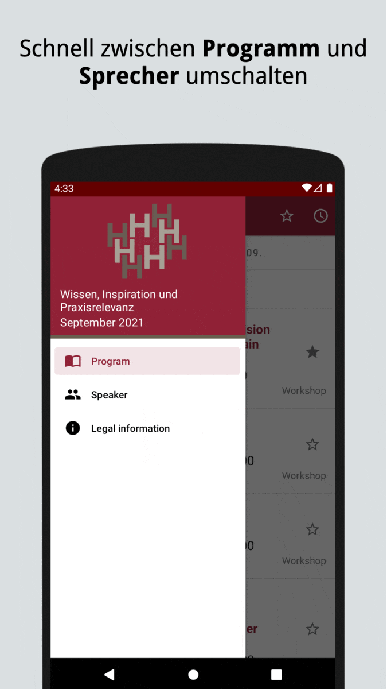

# An Ihre Wünsche anpassbare Konferenz-App

<table width="100%" style="border: none;">
<tr>
<td width="35%" style="border: none;"></td>
<td style="border: none;">
Sie veranstalten Tagungen, Konferenzen, oder Seminare, und sind auf der Suche nach einer schlanken, anpassbaren, echt nativen Konferenz-App für Android und iOS?

Dann ist unser <strong>Campus Planer</strong> genau das Richtige.

<ul>
<li>White Label-App für mehrtägige Veranstaltungen und Konferenzen</li>
<li>Auf Wunsch eigene Store-Einträge: Sie werden als Entwickler genannt</li>
<li>Echt nativ: Swift und SwiftUI unter iOS, Java/Kotlin und Material Design unter Android</li>
<li>Unterstützt Smartphones und Tablets optimal; unter Android auch an Foldables angepasst</li>
</ul>

Unser <strong>Campus Planer</strong> ist die offizielle Konferenz-App für den Herbstcampus.

</td>
</tr>
</table>

Möchten Sie eine an Ihre CI angepasste Version des Campus Planer? Sprechen Sie uns sehr gerne an. Eine kurze [E-Mail](mailto:mobile@mathema.de) genügt.