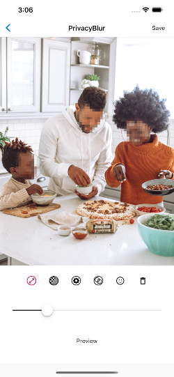

<table style="width: 100%; border: none">
<tr>
<td valign="top" style="width: 35%; border: none">

</td>
<td valign="top" style="border: none">

Herzlich willkommen zu den MATHEMA Apps.

Wir von MATHEMA &#160;❤&#160; Apps. Und wir lieben Open Source. Deshalb haben wir einige Apps für Android und iOS entwickelt.

Mit <a href="https://privacyblur.app/">PrivacyBlur</a> können Sie Bereiche Ihrer Fotos verpixeln. Das ist praktisch, wenn Sie Urlaubsfotos in sozialen Medien teilen, aber die Privatsphäre Ihrer Familie schützen möchten.

<a href="https://tkweek.app/">TKWeek</a> ist unser universelles Datums- und Kalenderwerkzeug. Ermitteln Sie für ein Datum die Kalenderwoche, addieren oder subtrahieren Sie Tage, Wochen oder Monate, und vieles mehr.

 Für alle Apps auf dieser Seite gilt:

<ul>
<li>Keine In-App-Käufe</li>
<li>Keine Werbung</li>
<li>Sie müssen nichts freischalten</li>
<li>Wir respektieren Ihre Privatsphäre</li>
<li>Vollständig <a href="https://github.com/MATHEMA-GmbH/">Open Source</a></li>
</ul>
</td>
</tr>
</table>
